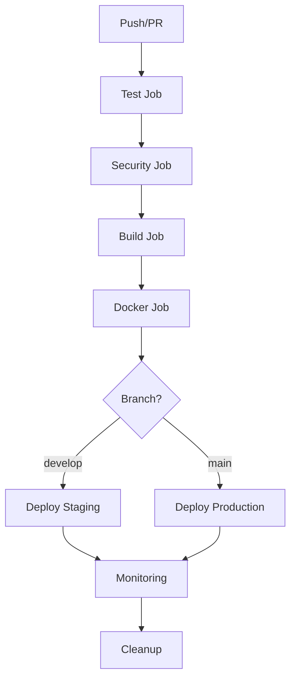

# CI/CD Pipeline - SmartFlowAI

## 📋 Przegląd

Kompletny scenariusz CI/CD dla aplikacji SmartFlowAI wykorzystujący GitHub Actions z automatycznymi testami, budowaniem i deploymentem.

---

## 🏗️ Struktura Pipeline

### 📊 Workflow Overview


### 🎯 Jobs w Pipeline

| Job                   | Czas     | Opis                                       | Trigger       |
| --------------------- | -------- | ------------------------------------------ | ------------- |
| **Test**              | ~3-5 min | Testy jednostkowe na Python 3.9-3.11       | Każdy push/PR |
| **Security**          | ~2-3 min | Skanowanie bezpieczeństwa (Bandit, Safety) | Po testach    |
| **Build**             | ~2-4 min | Budowanie aplikacji i artefaktów           | Po security   |
| **Docker**            | ~3-5 min | Build i push obrazu Docker                 | Tylko main    |
| **Deploy Staging**    | ~2-3 min | Deployment do środowiska staging           | Tylko develop |
| **Deploy Production** | ~2-3 min | Deployment do produkcji                    | Tylko main    |
| **Monitoring**        | ~1-2 min | Health check i powiadomienia               | Po deploy     |
| **Cleanup**           | ~1 min   | Czyszczenie starych artefaktów             | Zawsze        |

---

## ⚙️ Konfiguracja GitHub Repository

### 1. 🔐 Secrets w GitHub
Dodaj następujące secrets w Settings → Secrets and variables → Actions:

```bash
# Docker Hub
DOCKER_USERNAME=your-docker-username
DOCKER_PASSWORD=your-docker-password

# Produkcyjne API Keys (opcjonalnie)
PROD_OPENAI_API_KEY=sk-your-production-key
PROD_SUPABASE_URL=https://your-prod-supabase.co
PROD_SUPABASE_ANON_KEY=your-prod-supabase-key

# Powiadomienia (opcjonalnie)
SLACK_WEBHOOK_URL=https://hooks.slack.com/your-webhook
TEAMS_WEBHOOK_URL=https://your-teams-webhook
```

### 2. 🌍 Environments
Utwórz environments w Settings → Environments:

#### Staging Environment
- **Name:** `staging`
- **Protection rules:** Brak (automatyczny deploy)
- **Environment secrets:** Staging API keys

#### Production Environment
- **Name:** `production`
- **Protection rules:** 
  - ✅ Required reviewers (1-2 osoby)
  - ✅ Wait timer: 5 minut
- **Environment secrets:** Production API keys

### 3. 📋 Branch Protection Rules
W Settings → Branches dodaj reguły dla `main`:

- ✅ Require a pull request before merging
- ✅ Require status checks to pass before merging
  - ✅ `test (3.9)`
  - ✅ `test (3.10)` 
  - ✅ `test (3.11)`
  - ✅ `security`
- ✅ Require branches to be up to date before merging
- ✅ Restrict pushes that create files larger than 100MB

---

## 🚀 Instrukcje użycia

### Automatyczne triggery

#### 1. 📤 Push do main/develop
```bash
git add .
git commit -m "feat: nowa funkcjonalność"
git push origin main
```
**Rezultat:** Pełny pipeline z deploymentem do produkcji

#### 2. 📤 Push do develop
```bash
git push origin develop
```
**Rezultat:** Pipeline z deploymentem do staging

#### 3. 🔄 Pull Request
```bash
gh pr create --title "Feature: nowa funkcja" --body "Opis zmian"
```
**Rezultat:** Testy i security check (bez deploymentu)

#### 4. 🎯 Manualne uruchomienie
W GitHub → Actions → "SmartFlowAI CI/CD Pipeline" → "Run workflow"

### Monitoring Pipeline

#### 📊 Status Badge
Dodaj do README.md:
```markdown

```

#### 📧 Powiadomienia
Pipeline automatycznie wysyła powiadomienia o:
- ✅ Udanym deploymencie
- ❌ Błędach w testach
- 🔒 Problemach bezpieczeństwa

---

## 🐳 Docker Deployment

### Lokalne testowanie
```bash
# Build obrazu
docker build -t smartflowai:local .

# Uruchomienie z docker-compose
docker-compose up -d

# Sprawdzenie logów
docker-compose logs -f smartflowai

# Zatrzymanie
docker-compose down
```

### Produkcyjne użycie
```bash
# Pull najnowszego obrazu
docker pull your-username/smartflowai:latest

# Uruchomienie
docker run -d \
  --name smartflowai-prod \
  -p 8501:8501 \
  -e OPENAI_API_KEY=your-key \
  -e SUPABASE_URL=your-url \
  -e SUPABASE_ANON_KEY=your-key \
  your-username/smartflowai:latest
```

---

## 🔧 Konfiguracja lokalna

### 1. Przygotowanie środowiska
```bash
# Klonowanie repo
git clone https://github.com/your-username/SmartFlowAI.git
cd SmartFlowAI

# Tworzenie virtual environment
python -m venv venv
source venv/bin/activate  # Linux/Mac
# lub
venv\Scripts\activate     # Windows

# Instalacja zależności
pip install -r requirements.txt
pip install -r requirements-dev.txt
```

### 2. Pre-commit hooks (opcjonalnie)
```bash
# Instalacja pre-commit
pip install pre-commit

# Konfiguracja hooks
cat > .pre-commit-config.yaml << EOF
repos:
  - repo: https://github.com/psf/black
    rev: 23.3.0
    hooks:
      - id: black
  - repo: https://github.com/pycqa/isort
    rev: 5.12.0
    hooks:
      - id: isort
  - repo: https://github.com/pycqa/flake8
    rev: 6.0.0
    hooks:
      - id: flake8
EOF

# Instalacja hooks
pre-commit install
```

### 3. Lokalne uruchomienie testów
```bash
# Wszystkie testy
python run_tests.py

# Tylko testy produkcyjne
python -m pytest test_production_ready.py -v

# Z coverage
python -m pytest --cov=. --cov-report=html

# Testy bezpieczeństwa
bandit -r .
safety check
```

---

## 📊 Metryki i monitoring

### GitHub Actions Insights
- **Czas wykonania:** ~15-20 minut (pełny pipeline)
- **Koszt:** ~$0.008 za uruchomienie (GitHub Free: 2000 min/miesiąc)
- **Success rate:** Cel >95%

### Kluczowe metryki
- ✅ **Test coverage:** >80%
- ✅ **Build time:** <5 min
- ✅ **Deploy time:** <3 min
- ✅ **Security score:** 0 high/critical issues

### Alerty i powiadomienia
Pipeline wysyła alerty gdy:
- ❌ Testy nie przechodzą
- 🔒 Wykryto problemy bezpieczeństwa
- 📦 Build się nie udał
- 🚀 Deployment zakończony sukcesem/błędem

---

## 🛠️ Troubleshooting

### Częste problemy

#### 1. ❌ Testy nie przechodzą
```bash
# Sprawdź logi w GitHub Actions
# Uruchom testy lokalnie:
python -m pytest test_production_ready.py -v --tb=long
```

#### 2. 🐳 Docker build fails
```bash
# Sprawdź Dockerfile
# Test lokalnie:
docker build -t test-build .
docker run --rm test-build python -c "import streamlit; print('OK')"
```

#### 3. 🔐 Problemy z secrets
- Sprawdź czy secrets są ustawione w GitHub
- Upewnij się że nazwy są identyczne
- Sprawdź czy environment ma dostęp do secrets

#### 4. 🚀 Deployment fails
- Sprawdź logi w Actions
- Zweryfikuj konfigurację target environment
- Sprawdź czy wszystkie dependencies są dostępne

### Debug commands
```bash
# Sprawdzenie środowiska w Actions
env | sort

# Test połączenia z API
curl -f http://localhost:8501/_stcore/health

# Sprawdzenie Docker health
docker inspect --format='{{.State.Health.Status}}' container-name
```

---

## 📈 Optymalizacja Pipeline

### Przyspieszenie buildów
1. **Cache dependencies:** ✅ Już skonfigurowane
2. **Parallel jobs:** ✅ Matrix strategy dla testów
3. **Conditional jobs:** ✅ Deploy tylko dla main/develop
4. **Artifact reuse:** ✅ Build raz, deploy wielokrotnie

### Redukcja kosztów
1. **Skip redundant jobs:** Użyj `if` conditions
2. **Optimize Docker layers:** Multi-stage builds
3. **Use self-hosted runners:** Dla większych projektów

### Bezpieczeństwo
1. **Least privilege:** Minimalne uprawnienia
2. **Secret rotation:** Regularna zmiana kluczy
3. **Dependency scanning:** Automatyczne sprawdzanie CVE
4. **Code signing:** Podpisywanie artefaktów

---

## 🎯 Następne kroki

### Rozszerzenia Pipeline
1. **Performance testing:** Dodanie testów wydajności
2. **E2E testing:** Selenium/Playwright testy
3. **Multi-environment:** Dev/Staging/Prod environments
4. **Blue-Green deployment:** Zero-downtime deployments
5. **Rollback mechanism:** Automatyczny rollback przy błędach

### Integracje
1. **Slack/Teams:** Powiadomienia o deploymentach
2. **Jira:** Automatyczne zamykanie tasków
3. **Monitoring:** Datadog/New Relic integration
4. **Security:** SonarQube/CodeQL analysis

---

## 📁 Pliki CI/CD w projekcie

### Utworzone pliki:
- ✅ `.github/workflows/ci-cd.yml` - Główny pipeline
- ✅ `Dockerfile` - Obraz Docker aplikacji
- ✅ `.dockerignore` - Wykluczenia dla Docker
- ✅ `docker-compose.yml` - Lokalne testowanie
- ✅ `CI_CD_Instrukcje.md` - Ten plik instrukcji

### Istniejące pliki testowe:
- ✅ `test_production_ready.py` - Główne testy
- ✅ `run_tests.py` - Test runner
- ✅ `pytest.ini` - Konfiguracja pytest

---

**Utworzono:** 13 czerwca 2025  
**Autor:** Claude + Dariusz  
**Projekt:** SmartFlowAI CI/CD  
**Status:** ✅ Gotowe do wdrożenia 